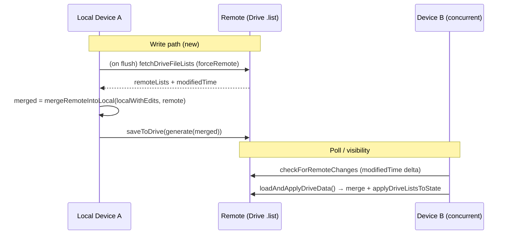
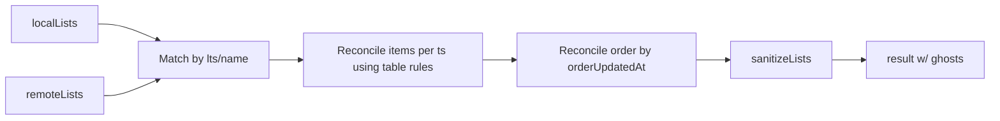

# Design: Deletion-Safe Sync & Merge for Inbox PWA Multi-Device Editing

**Author**: Systems Architect (Grok)  
**Date**: 2026-07-05  
**Status**: Draft  
**Related**: `index.html` (4178 LOC, vanilla JS PWA, Google Drive `.list` backend)

---

## Overview

The Inbox PWA is a single-file (`index.html`) offline-first application using the user's private Google Drive `*.list` files for cross-device sync (no server). Core features include multiple lists, check/uncheck, text/due/recurrent edits, drag reorders (items/lists/files), cross-list and cross-file moves, and hard deletes.

Current sync relies on:
- Debounced (350ms) full-file `PATCH` overwrites via `saveData()` → `flushPendingDriveSave()` → `saveToDrive()` + `generateListFile()`.
- `modifiedTime` polling (~2500ms) + hooks (focus, visibility, online, reconnect) calling `loadAndApplyDriveData()`.
- `mergeRemoteIntoLocal(localLists, remoteLists)` (~lines 617-673) which walks by list name + item `timestamp` (birth `Date.now()`), prefers remote for structure, keeps local-only items, and only versions checks via `toggledAt`/`checkedAt`.
- No tombstones; deletes are `Array.splice` in `deleteItem` (3914) and `deleteCurrentList` (2686).
- Cross-file moves (1809-1836) bypass merge entirely via direct fetch + mutate + `flushDriveFileInBackground`.

This leads to frequent unwanted data loss or resurrection during concurrent editing, especially deletes (see risks below). The proposed design makes **data deletion prevention the top priority**: "never lose user data created on any device." We prefer duplication/safety over clean deletes on conflicts. Deletes become explicit, timestamped operations (generalizing the existing `toggledAt` pattern) that only win when they are verifiably the latest operation on an item/list.

The design:
- Evolves the human-readable `.list` format **compatibly** using `//` tombstone comments (old parsers ignore them).
- Adds generalized versioning (`updatedAt`, list `orderUpdatedAt`/`timestamp`, `deletedAt`).
- Introduces read-merge-write on write paths to shrink race windows.
- Rewrites merge with per-field LWW + delete-vs-activity comparison.
- Handles items, lists, checks, text, due, recurrence, order, and cross-file moves.
- Adds migration (absent `deletedAt` = alive) and extensive self-tests for concurrent scenarios.
- Remains 100% serverless, dependency-free, single HTML file.

---

## Background & Motivation

### Current State (key excerpts from `index.html`)
- **Identity**: Item `timestamp` (numeric `Date.now()` at creation). Lists matched by `name` only.
- **Versioning**: Only `toggledAt` (and fallback `checkedAt`) for check state. Newer toggle wins in merge (lines 632-649). No `updatedAt` for text/due/order.
- **Merge** (`mergeRemoteIntoLocal`):
  ```js
  // remote items first (with local toggle winner)
  const mergedItems = (remoteList.items || []).map(...)
  // local-only appended
  localItems.forEach(lIt => { if (!remoteTsSet.has(lIt.timestamp)) mergedItems.push(lIt); });
  // local-only lists appended
  ```
- **Writes**: Always full `generateListFile()` (3961) emitting `# Name\n- [x] text |ts:..|tg:..|cts:..|due:..`.
- **Parse** (3979): Strips `|tg|cts|due` then `|ts:` / legacy `@`.
- **Deletes**: Hard `splice`; no record. `saveAndRender({op:'delete', ...})`.
- **Cross-file**: Direct splice + async target mutate + background save (no `merge`).
- **Races**: Debounce + poll + `hasPendingUpload` guard (1038) + `driveSyncReady`; Drive `modifiedTime` (not a perfect sequence).
- **Recurrence/Due**: `syncRecurrenceState` (3247) and `syncDueState` (3413) mutate `checked`/`dueAt` + call `saveData()`.
- **Caches**: `driveFileCache`, `persistedDriveFileCache`, `restoreActiveDriveFileFromCache`.

### Pain Points & Quantified Risks (from prompt + code)
1. **Hard deletes + "local-only survives"**: Device with item always resurrects on merge (lines 659-663, 669-670). Deletes rarely propagate.
2. **Concurrent edit + delete**: Last full overwrite drops slower device's adds/edits.
3. **List deletes**: Resurrect entire lists + contents (splice + local append).
4. **No `updatedAt`**: Text/due edits favor remote snapshot (no per-field compare).
5. **Race windows**: 350ms debounce + 2.5s poll + pending checks; `modifiedTime` collisions possible on near-simultaneous writes.
6. **Cross-file moves**: No merge (1824-1830); direct clobber risk.
7. **No delete records**: Nothing makes a delete "win" reliably.
8. **Startup/reconnect**: Cache (`684`) vs remote decisions; `loadData()` seeds examples.
9. **Reorders**: No versions; array position only (1984 `reorderInArray`); last write wins or appends.
10. **Recurrence side-effects**: Mutates checked state (can race with toggles).

User data loss (or frustrating resurrection) is the dominant complaint vector for multi-device use. "Human-readable export" via `.list` modal (3935) and Drive files must be preserved/evolved compatibly.

---

## Goals & Non-Goals

### Goals
- **Deletion safety first**: Never lose created data. Deletes are explicit + timestamped and only win when latest vs. any activity (create/update/toggle) on the item.
- Improve concurrent safety for items (check/text/due/recurrent/order), lists (name/order/delete), and cross-file moves.
- "Pull on write"/read-merge-write to reduce clobber windows.
- Generalize versioning from `toggledAt` pattern.
- Robust item identity (keep `timestamp` primary; document skew risks).
- Compatible evolution of `.list` format (old parsers read new files without ts corruption or bogus items; new code cleans up).
- Migration for existing data (no `deletedAt` → non-deleted).
- Realistic incremental rollout via PRs + self-tests for concurrent cases (extend `runDueSelfTest`/`runRecurrenceSelfTest` pattern at DEBUG time).
- UX: Safety > perfect consistency. Silent recovery preferred; log conflicts in DEBUG. No data loss > clean state.
- Preserve single-file, no-deps, PWA, human-readable export, Drive-only architecture.

### Non-Goals
- Full CRDTs / vector clocks / OT (too complex/heavy for vanilla single-file).
- Backend, push notifications, or Drive webhooks.
- Trash UI / undelete flow (future; current focus is prevention of *unwanted* deletes).
- List rename conflict resolution beyond basic (names + optional `lts`).
- Changing auth / Drive client ID / SW caching.
- Immediate purge of tombstones (keep small deleted markers for propagation; human export will show `// deleted` comments).
- Perfect global ordering or strong consistency.

---

## Proposed Design

### Architecture Overview (Mermaid)


Current flow (for contrast):
- Pure last-writer + biased append merge on pull only.
- No pre-write pull in debounced path.

### Data Model Changes
- **Item** (in lists):
  - Add: `updatedAt?: number` (text edit, due change via text or future direct).
  - Add: `deletedAt?: number` (explicit delete op time).
  - Preserve: `timestamp` (birth id), `toggledAt`, `checkedAt`, `dueAt`, `text`, `checked`.
- **List**:
  - Add (new lists): `timestamp?: number` (birth id for robust matching).
  - Add: `orderUpdatedAt?: number` (on item reorder within list).
  - Add: `deletedAt?: number` (for list delete).
  - `name` remains for compat + human.
- **Tombstones** (for propagation without polluting main content or old parsers):
  - Not a top-level array in state (to minimize); represented as "ghost" items inside `items[]` with `deletedAt` + minimal fields, or collected during parse.
  - Serialized as `// deleted ts:NNN del:MMM` (under `# List` for item ghosts) or `// deleted-list name:Foo|ts:NNN del:MMM`.
  - Old `parseListFile` ignores `//` lines → no bogus items.
  - New parse injects ghosts into `current.items`.
- **Ghost items**: `{ timestamp, deletedAt, text: '', checked: false }` (or copy last-known at del time for recovery). UI/render always filters `!item.deletedAt`.
- **Sanitize / isValidItem**: Relax slightly for ghosts (`deletedAt` present → valid even with empty text). Preserve all new fields.
- **No schema migration needed on load**: Absent `deletedAt`/`updatedAt` means "alive, use ts as baseline".

**Example evolved `.list` (new writes)**:
```
# Work
- [ ] Finish report |ts:1720000000000|upd:1720000000100|due:1720100000000
- [x] Call client |ts:1720000001000|tg:1720000002000|cts:1720000002000
// deleted ts:1720000000500 del:1720000003000
# Personal
// listmeta lts:1720000004000 lupd:1720000004100
// deleted-list name:Archive|ts:1719000000000 del:1720000005000
```

(Old parsers see only the `-` and `#` lines with original names; `//` skipped.)

### Core: Enhanced Merge (`mergeRemoteIntoLocal`)
Replace/extend current logic (617). Signature stays for compat with callers.

Key rules (deletion safety #1):
- Match lists: by `timestamp` (preferred, "lts") or `name` (legacy).
- Per unique item `timestamp` (across local/remote, including ghosts):
  1. Collect `lIt`, `rIt` (ghosts have deletedAt + minimal fields).
  2. Compute activity = max(ts, updatedAt||0, toggledAt||0, due edit implicit).
  3. maxDel = max(l.deletedAt||0, r.deletedAt||0).
  4. If maxDel > maxActivity on *any* side's non-del version: deleted wins (emit/update ghost). Delete only respected when verifiably latest.
  5. Else alive: LWW per field (toggledAt existing for check; updatedAt for text/due; local bias on due tie as today).
- Local-only items (incl. dels) kept + emitted (safety bias + to propagate their dels).
- Remote-only ghosts kept (to propagate dels to third devices).
- Order: Winner = side with higher list.orderUpdatedAt (or remote default). Common surviving items in that relative order; appends at end.
- List dels: analogous (ghost list obj with deletedAt kept for emission as // tombstone; filter from render/clamp).
- Result always passed through `sanitizeLists` (updated to preserve + relax for ghosts).

**Mermaid: Merge Decision for an Item**
```mermaid
flowchart TD
    A[Same ts item in local+remote] --> B{maxDel > maxActivity?}
    B -->|Yes| C[Emit ghost with deletedAt<br/>Delete wins]
    B -->|No| D[Alive: LWW per field<br/>toggledAt for check<br/>updatedAt for text/due<br/>keep local adds]
    E[Local-only or Remote-only] --> F[Include (with del if present)<br/>Safety bias for local]
```

**Exhaustive Merge Delete/Conflict Scenarios Table** (10+ cases with concrete ts values; used for self-tests in PRs):

| # | Scenario | Local (device A) | Remote (device B, from Drive) | Expected Merged Result (ghosts noted) | Rationale / Notes |
|---|----------|------------------|-------------------------------|---------------------------------------|-------------------|
| 1 | Remote delete wins (no local activity after) | Item ts=100, no del, text="foo" | Item ts=100, deletedAt=200 | Ghost ts=100, deletedAt=200 (filtered from UI) | maxDel=200 > act=100. Delete propagates. |
| 2 | Local edit after remote delete → resurrection (safety) | Item ts=100, updatedAt=250, text="foo edited" | Item ts=100, deletedAt=200 | Alive ts=100, updatedAt=250, text="foo edited" (no del) | 250 > 200 → keep alive version. Text from local. |
| 3 | Concurrent create (A) + delete (B, same ts) | Item ts=100 (new) | Ghost ts=100, deletedAt=105 | Ghost (del wins if del>create; borderline rare) or keep per tie rule (prefer safety keep if =). | Treat as del if strictly > ts. |
| 4 | Local delete, remote unaware (local-only del) | Ghost ts=100, del=150 | No item | Ghost emitted in result (local del propagates on next write). | Local-only dels kept for tombstone. |
| 5 | List delete vs contained item activity | List "L" ts=50, del=300 (no items) | List "L" ts=50, item ts=60 updatedAt=200 | Ghost list (if list del > item act) or list+item alive. Per list del rule. | List del covers contents unless item act > list del. |
| 6 | Cross-list recurrence move vs del | Item ts=100 in listA (recurrent, just toggled) | Ghost in listA del=120; item present in listB? | Depends; recurrence promote is move (no del). If explicit del on one side after move act, compare. | Moves do not set deletedAt. |
| 7 | Order reconciliation with del in middle | Items [ts1 alive, ts2 del=200, ts3 alive]; orderUpdatedAt=180 | Items [ts1, ts3] (no del) orderUpdatedAt=250 | Alive [ts1, ts3] in remote order (ts2 ghost dropped). | Del ghosts excluded from order; winner order from higher orderUpdatedAt. |
| 8 | Cross-file move (structural splice, no del) + immediate source flush | Source: splice ts=100 (move intent); then direct save (no pull) | Target remote has ts=100 upd=180; source remote still shows item in source list | Source file: item removed (direct generate+save after splice preserves relocation). Target: reconciled item (pull+merge add, prefer higher fields). No dupe/loss if successful. | Structural source removal uses direct write (bypass read-merge) to avoid resurrection from remote pre-move snapshot. Target still safe pull+merge. See cross-file section. |
| 9 | Remote del + local recurrence auto-complete (toggled race) | Item ts=100, toggledAt=180 (via syncRecur) | Ghost del=150 | Alive (toggled 180 > del). updatedAt/toggled set. | syncRecur skips ghosts; toggled LWW after del check. |
| 10 | Text edit concurrent with del on other device + due | Local: upd=300, due=... | Remote: del=250, old text | Alive with local text/due (300>250). | Field LWW + del check. |
| 11 | List rename + del on different devices | List name="Foo" ts=50 (renamed locally) | Ghost list "Foo" del=200 (by old name) | Match by lts=50; del vs local activity decide. | lts preferred. |
| 12 | Local-only list del | List "Bar" ts=70 del=180 | No list "Bar" | Ghost list tombstone emitted. | Local safety + propagate. |

Pseudocode (per-item core inside list merge; lists matched by lts or name):
```js
function reconcileItem(lIt, rIt) {
  if (!lIt && !rIt) return null;
  const lDel = lIt?.deletedAt || 0, rDel = rIt?.deletedAt || 0;
  const maxDel = Math.max(lDel, rDel);
  const lAct = Math.max(lIt?.timestamp||0, lIt?.updatedAt||0, lIt?.toggledAt||0);
  const rAct = Math.max(rIt?.timestamp||0, rIt?.updatedAt||0, rIt?.toggledAt||0);
  const maxAct = Math.max(lAct, rAct);
  if (maxDel > maxAct) {
    const base = lDel >= rDel ? lIt : rIt;
    return { ...base, deletedAt: maxDel, text: base.text || '' /* ghost */ };
  }
  // alive merge (LWW + existing toggle bias + local due bias)
  let winner = (rIt && (!lIt || (rIt.updatedAt||0) >= (lIt.updatedAt||0))) ? {...rIt} : {...lIt};
  // toggle LWW as today (lines 632+)
  const rVer = Number(rIt?.toggledAt) || Number(rIt?.checkedAt) || 0;
  const lVer = Number(lIt?.toggledAt) || Number(lIt?.checkedAt) || 0;
  if (lVer > rVer) { /* local toggle wins as current */ ... }
  if ((lIt?.updatedAt||0) > (winner.updatedAt||0)) winner.text = lIt.text; /* etc for due */
  return winner;
}
```
After per-item: filter alive for order winner, append local-only alive + ghosts. Same for lists (ghost lists for dels).

**Top-level lists[] result assembly pseudocode (remote + local + ghosts + order):**
```js
function assembleResultLists(reconciledByNameOrLts, localOnlyLists, remoteLists, localLists) {
  const result = [];
  // 1. Determine list order winner (higher orderUpdatedAt or default remote bias for lists)
  const listOrderWinner = (localLists.orderUpdatedAt || 0) > (remoteLists.orderUpdatedAt || 0) ? 'local' : 'remote';
  const baseOrder = listOrderWinner === 'remote' 
    ? remoteLists.filter(r => !isDeletedListWin(r))   // non-ghost remote order
    : localLists.filter(l => !isDeletedListWin(l));
  // 2. For each in baseOrder, push the reconciled version (ghost or alive)
  baseOrder.forEach(baseL => {
    const rec = reconciledByNameOrLts[baseL.name || baseL.timestamp];
    if (rec) result.push(rec);  // may be ghost list {name, timestamp, deletedAt, items:[] or ghosts}
  });
  // 3. Append local-only non-deleted lists (safety bias)
  localOnlyLists.forEach(lo => {
    if (!isDeletedListWin(lo)) result.push(lo);
  });
  // 4. Ghost lists (dels that won or local dels to propagate): append at end for emission
  //    (or insert at prior relative position if tracked; end is simple & safe)
  const allGhostLists = ...collect from reconciled and local dels...;
  allGhostLists.forEach(g => { if (!result.some(r => r.timestamp === g.timestamp)) result.push(g); });
  return sanitizeLists(result) || result;
}
```
- Ghost lists are present in the merged `result` array (carry tombstone `// deleted-list` in generate) but **filtered** for UI: `getAliveLists()` = filter `!l.deletedAt` in renderTabs, clampCurrentIndex, etc.
- List reorders (tab drag on lists) set `list.orderUpdatedAt` (or a top-level on the lists container) and use the winner logic above.
- Current remote-first + append bias is largely preserved for lists (with orderUpdatedAt tie-breaker for common lists and ghosts segregated for emission).

**Mermaid for full per-list merge flow** (simplified):


This covers all cases from Issue 1 (add vs del, resurrection, list+item, cross-file move, recurrence race, order). Self-tests will assert exact outputs.

### Read-Merge-Write & Race Reduction (Offline/Keepalive/Async Realities)
Current flush is fire-and-forget (timer, `pagehide` keepalive, `saveToDrive` early-returns on !onLine, async PATCH with no await in many listeners). Design makes it pull-first where feasible without breaking offline-first or keepalive.

**Updated flush logic sketch (vanilla, no new async primitives beyond existing):**
```js
async function flushPendingDriveSave({ keepalive = false } = {}) {
  if (state.saveDataDriveTimer) { clearTimeout(...); state.saveDataDriveTimer = null; }
  if (!state.driveConnected || state.driveFileSwitching) return;
  const fileId = getActiveDriveFileId();
  if (!fileId) return;

  let content;
  if (navigator.onLine && !keepalive) {
    try {
      const { lists: remote } = await fetchDriveFileLists(fileId, ..., { forceRemote: true });
      const merged = mergeRemoteIntoLocal(state.lists, remote || []);
      // Adopt merged (may bring remote dels or resolve) for this save + state (safety)
      if (getDriveListsSignature(merged) !== getDriveListsSignature(state.lists)) {
        applyDriveListsToState(merged, { persist: false, renderNow: false }); // silent adopt
      }
      content = generateListFile(merged);
    } catch (e) {
      if (DEBUG) console.warn('[Drive] pre-flush pull failed, falling back to local', e);
      content = generateListFile(state.lists); // fallback preserves local (incl ghosts/dels)
    }
  } else {
    // Offline or keepalive: best-effort local (no pull). Later reconnect/online will pull+merge.
    // keepalive: must be sync body; no await fetch.
    content = generateListFile(state.lists);
  }
  // Always attempt saveToDrive (handles keepalive flag + !onLine early return inside)
  saveToDrive(content, { fileId, keepalive });
}
```
- `saveData()` (debounce setter): unchanged timer setup. The actual flush now does the pull when possible.
- Offline: skip pull, write local + cache; `online` listener already does `loadAndApply...` (will merge).
- keepalive/pagehide/visibility hidden: **no-pull path** (use current local generate). Fetch would be dropped anyway.
- Error on pull: fallback to current local (never lose local intent).
- Concurrent edits during RTT: last local state (post any user ops) wins the merge input; post-merge adopt only if changed.
- driveFileSwitching / driveSyncReady: respected (early returns).
- `loadAndApplyDriveData` unchanged for pure-pull cases; now merge always produces ghosts correctly.
- Cross-file: in commitDrop file-pill (see below) — separate target pull+merge+generate (no main flush).

`saveToDrive` (post successful PATCH) still does the meta GET for authoritative remoteModified + cache.

This is fully implementable in current async/keepalive model (use `if (!keepalive && navigator.onLine)` guard around await fetch).

**Cross-file pull-first update (in commitDrop):**
```js
// after source splice + clamp
(async () => {
  try {
    let targetLists = await fetch... (targetFile.id) || cache;
    // merge the movedItem as "add" (reconcile if ts exists)
    const targetListIdx = ...
    const existing = ...find by ts;
    if (existing) { /* reconcile fields, prefer higher versions */ }
    else targetLists[...].items.unshift(movedItem);
    // NO deletedAt (this is move)
    cache...;
    if (active) apply...;
    flushDriveFileInBackground(targetFile.id, generateListFile(targetLists));
  } catch { re-add to source locally; alert; }
})();
```
Source save via normal (now pull-merge) path.

### Delete UX & Propagation + Full Affected Sites Audit
- `deleteItem(listIndex, idx)`: **Do not splice**. Set `item.deletedAt = Date.now()`. Optionally splice+push to end for index stability. `saveAndRender({op:'delete', itemTs, ...})`.
- `deleteCurrentList`: `list.deletedAt = Date.now()` (keep ghost list in state.lists for tombstone emission; do **not** splice the list for propagation). Update confirm count using alive items. `clamp` (on alive), save, render.
- All render/sync/patch paths: filter using `!item.deletedAt && !list.deletedAt` (see full audit in "State Mutation Paths" section above).
- Ghosts persist in arrays (Drive + localStorage) until future purge.
- Resurrection: on merge alive version wins → full fields (text etc.) restored from the editing side's object.

**RecurrenceJustCompleted fix (critical for merge/ghosts/cross-device)**: Change from `Set<item object refs>` (3035, 3079, 3259, 3269) to `Set<number>` of timestamps. In `completeRecurrentItem`: `recurrenceJustCompleted.add(item.timestamp)`. In `syncRecurrenceState`: `if (recurrenceJustCompleted && recurrenceJustCompleted.has(item.timestamp)) return;`. Clear as before. This survives merge (new objects), parse, file switch (`state.lists =`), apply, ghosts (skipped anyway), and cross-device (session-local "just" only; merge may re-trigger eval). Add to self-tests. The skip is best-effort session only.

**Full sites that must filter ghosts or use ts-based access (from code audit; all updated in implementation):**
(See exhaustive list + strategy in Risks & State Mutation Paths section above. Key examples:)
- renderTabs (2620 forEach on lists), renderItems (3792+), countItemsBySection (3524), classify, updateSectionCounts, ensureActiveUl, mount..., patchDeleteItem/patch* (3709+: use ts fallback + reindex after filter; relax length==0 checks), reindex/getItemIndexByTs (3549+, 3560: ts map works with ghosts present), syncRecur (3249 forEach + promote only alive), syncDue (3415), clampCurrentIndex (2033: length on alive or post-filter), drag commit (structural splices only on alive), findListIndexByName, createItemElement callers, saveAndRender decision, getDriveListsSignature (optional normalize), all direct state.lists= post-processing, recurrence promote/return (3020/3029: moves, skip ghosts), list iteration in switch/add/create/remove (post assign or via getAlive).
- Patch after soft-del: patchDelete uses ts to find li, removes, calls reindex (ts map), update counts (on alive).
- Strategy: helper `filterAliveItems` + move ghosts to array end on del. Patch/reindex never assume contiguous active indices for length.

This prevents the breakage described (index skew, broken patches, empty states, recurrence flicker).

### List Identity & Order
- New lists: `timestamp = Date.now()`.
- Reorder (items via drag, `reorderInArray`): `list.orderUpdatedAt = Date.now()`.
- List rename: name changes; `timestamp` (and any `orderUpdatedAt`) preserved.
- Merge uses `lts` (list ts) when present.

### Text / Due / Edit Versioning
- `editItem` (saveEdit): `targetItem.updatedAt = Date.now()`.
- `applyDueFromText` / due changes: set `updatedAt` if value actually changes.
- `addItem`: `updatedAt = timestamp`.
- Parse/generate: support `|upd:NNN` (placed with ts last for resilience; new parse strips + post-cleans text of legacy garbage suffixes).
- Merge: higher `updatedAt` wins text/due (tie → prefer remote or local bias).

### Cross-File Moves (1809 area) — Structural Relocation Semantics
Cross-file move (drag item to file-pill) is a *structural relocation*, **not** a user delete (no `deletedAt` set on source). The item must reliably end only on the target file with its identity (ts) and latest fields preserved. No data loss.

**Handling (resolves post-splice read-merge resurrection):**
- Source: splice the item out of local source list (as today). This is authoritative local structural intent for the *source file*.
- To prevent the immediate `saveData()` (which triggers flush with pull+merge) from resurrecting the item (remote may still show it in source list per merge logic at 630: remote items first + local append only for absent ts):
  - After splice + clamp, perform **direct** `saveToDrive( generateListFile() )` (or equivalent direct flush without the read-merge pull step) for the *source file only*.
  - Clear any pending saveDataDriveTimer.
  - This bypass is narrowly for this structural move op (documented in State Mutation Paths as "Hard structural removes (bypass merge for this write)").
- Target (async, as today but improved):
  1. `const {lists: targetLists} = await fetchDriveFileLists(targetId, ..., {forceRemote:true}) || cache;`
  2. Find/create target sub-list by name.
  3. Reconcile the movedItem into target (if ts exists: merge fields preferring higher versions; else unshift).
  4. `cacheDriveFileLists(...)`
  5. If the target file is now active: `applyDriveListsToState(targetLists)`
  6. `flushDriveFileInBackground(targetId, generateListFile(targetLists))`
- Failure on target: re-insert to source locally + alert (as today; "check Drive").
- The item identity (ts) is preserved; latest version wins on target via reconcile.

This ensures source write after move does not pull the pre-move remote version and undo the removal. Target benefits from pull+merge for safety.

Update to State Mutation Paths (see below) and scenarios table case 8. 

**Code sketch for file-pill commitDrop (in the 'file-pill' branch):**
```js
const movedItem = state.lists[state.currentIndex].items.splice(fromIdx, 1)[0];
clampCurrentIndex();
const targetFile = ...;
// immediate direct source write (bypass pull-merge to preserve relocation)
if (state.driveConnected) {
  // direct, no timer, no pull
  saveToDrive( generateListFile(), { fileId: getActiveDriveFileId() } ).catch(()=>{});
} else {
  saveData(); // local only
}
render();

// async target (pull + reconcile + background write)
(async () => {
  try {
    let targetLists = state.driveFileCache[...] || (await fetch... then parse);
    const tIdx = findTargetListIndexByName(targetLists, sourceListName);
    const existing = targetLists[tIdx].items.find(i => i.timestamp === movedItem.timestamp);
    if (existing) {
      // reconcile (prefer higher updatedAt/toggled etc from movedItem or existing)
      if ((movedItem.updatedAt||0) > (existing.updatedAt||0)) existing.text = movedItem.text; // etc
    } else {
      targetLists[tIdx].items.unshift(movedItem);
    }
    cache...;
    if (is active target) apply...;
    if (connected) flushDriveFileInBackground(targetFile.id, generateListFile(targetLists));
  } catch(e) {
    // re-add to source state + alert
    state.lists[...].items.unshift(movedItem); // safety
    showAlert(...);
  }
})();
```

**Updated scenarios table case 8 (see table below for full).** Source removal protected by direct write.

### Recurrence / Due Side Effects
- `syncRecurrenceState` / `syncDueState`: Skip items with `deletedAt`. When they mutate `checked`/`toggledAt`/`dueAt`, also set `updatedAt` (or rely on toggle).
- These trigger saves → now go through read-merge-write.

### Format Evolution (parse/generate) + Precise Pseudocode + Sanitize + Compat
**generateListFile** (updated; ts always final suffix for alive; // tombstones for dels):
```js
// pseudocode
return src.map(list => {
  if (list.deletedAt) return `// deleted-list name:${list.name}|lts:${list.timestamp || ''}|del:${list.deletedAt}`;
  let header = `# ${list.name}`;
  const metaLine = (list.timestamp || list.orderUpdatedAt) ? `// listmeta lts:${list.timestamp || ''} lupd:${list.orderUpdatedAt || ''}` : '';
  const lines = [];
  (list.items || []).forEach(item => {
    if (item.deletedAt) {
      lines.push(`// deleted ts:${item.timestamp} del:${item.deletedAt}`);
      return;
    }
    const upd = item.updatedAt ? `|upd:${item.updatedAt}` : '';
    const due = ...; const cts=...; const tg=...;
    lines.push(`- ${item.checked?'[x]':'[ ]'} ${item.text} ${upd}${due}${cts}${tg} |ts:${item.timestamp}`);
  });
  let out = header;
  if (metaLine) out += '\n' + metaLine;
  if (lines.length) out += '\n' + lines.join('\n');
  return out;
}).join('\n\n').trim();
```
(Strict: metadata **only** on post-# `// listmeta lts:.. lupd:..` or `// deleted-list ...` comment lines. NEVER put metadata on the `# Name` line itself. In parse, after detecting # line: `let name = line.slice(2).trim().replace(/\s*\/\/.*$/, '').trim();` to guarantee clean name even on mixed files. This matches current parse exactly (slice(2).trim()) + minimal defensive clean.)

**parseListFile** (exact enhanced sketch; strips new fields before ts match; handles // anywhere under current):
```js
// inside the per-line loop, after # handling and before/after - handling:
let workingRest = rest;
let updatedAt, deletedAt, toggledAt, checkedAt, dueAt;
// strip all metadata suffixes (order independent; loop or explicit)
const stripMeta = (key) => {
  const m = workingRest.match(new RegExp(`\\|${key}:(\\d+)$`));
  if (m) { /* set var */ workingRest = workingRest.slice(0, -m[0].length); }
};
stripMeta('del'); stripMeta('upd'); stripMeta('tg'); stripMeta('cts'); stripMeta('due');
// then ts (now reliably at end or legacy @)
const tsMatch = workingRest.match(/ (?:\|ts:|@)(\d+)$/);
...
const newItem = {text: itemText.trim(), timestamp, checked};
if (deletedAt) newItem.deletedAt = deletedAt;
if (updatedAt) newItem.updatedAt = updatedAt;
// ... other fields
current.items.push(newItem);

// after main loop or in separate pass for comments under current:
if (current && /^\/\/ deleted ts:(\d+) del:(\d+)/.test(line)) {
  const [,ts,del] = ...; current.items.push({text:'', timestamp:Number(ts), checked:false, deletedAt:Number(del)});
}
if (current && /^\/\/ (?:deleted-list|listmeta)/.test(line)) {
  // parse lts/del/lupd and attach to current list (or collect separate tombstone map)
  // Note: the # line name extraction must remain clean: name = line.slice(2).trim().replace(/\s*\/\/.*$/, '').trim()
}
// also support global // at end for list tombstones if no current
```

**sanitizeLists** update (2012):
```js
items: l.items.filter(it => {
  if (it.deletedAt && Number.isFinite(it.deletedAt)) return true; // keep ghost even if minimal text
  return isValidItem(it);
}).map(it => {
  const s = {text: it.text, timestamp: it.timestamp, checked: !!it.checked};
  if (it.deletedAt) s.deletedAt = it.deletedAt;
  if (it.updatedAt) s.updatedAt = it.updatedAt;
  // preserve others + due etc as today
  ...
  return s;
})
```
Relax `isValidItem`:
```js
function isValidItem(it) {
  if (!it) return false;
  if (it.deletedAt) return Number.isFinite(it.timestamp);
  return typeof it.text==='string' && Number.isFinite(it.timestamp) && typeof it.checked==='boolean';
}
```

**Compat examples**:
- Old file (no markers) parsed by new: all alive (no deletedAt/updatedAt).
- New alive item ` - foo |upd:123|ts:456 ` parsed by old: ts correct (ts last), text="foo |upd:123" temporarily → new code post-clean on load/parse: `text = text.replace(/\s*\|(upd|del|tg|cts|due):\d+/g,'').trim()`.
- Del: `// deleted ts:100 del:200` under # List → new creates ghost; old ignores line (no bogus item).
- Legacy @ts at end + new |upd before: handled by strip before ts regex.
- Roundtrips + self-tests (parse(generate(x)) === x normalized) added in PR1.

Always add `// format:2` or `// inbox.list v2` at top of new generates (old ignores). Update parse to detect.

### Sanitize & Other
- `sanitizeLists` (2012): Preserve `updatedAt`, `deletedAt`, `orderUpdatedAt`, list `timestamp`. Relax `isValidItem` for ghosts.
- `applyDriveListsToState`, caches, `loadData`: Unchanged (sanitize will handle).
- `getDriveListsSignature`: May need update if ghosts affect (or normalize by stripping dels for sig? keep simple: use full for now).

---

## API / Interface Changes

Internal only (no public API). Call sites updated in place:

- `mergeRemoteIntoLocal(local, remote)` → richer behavior (same inputs/outputs).
- `deleteItem`, `deleteCurrentList` → soft (set `*At`).
- `generateListFile(lists?)`, `parseListFile(text)` → extended (backward compat).
- `saveAndRender(patch)` / patches: `delete` still works (DOM removal via `patchDeleteItem`); ghosts filtered upstream.
- New helpers: `isDeleted(item)`, `filterAliveItems(list)`, `getListTimestamp(list)` etc. (can be inline).

Before (delete):
```js
items.splice(itemIndex, 1);
saveAndRender({ op: 'delete', ... });
```

After:
```js
const it = items[itemIndex];
it.deletedAt = Date.now();
// keep it for tombstone emission
saveAndRender({ op: 'delete', itemTs: it.timestamp, ... });
```

---

## Data Model Changes

See "Proposed Design". No DB migration; file format additive.

**Serialization impact**:
- Drive `.list` files grow slightly (tombstones + `|upd:`).
- `localStorage` `inboxLists` same.
- Caches (`driveFileCache`) will hold ghosts.

**Cleanup**: Future PR could add manual "purge tombstones older than X" or on startup if all known devices have higher `modifiedTime`.

---

## Risks & Mitigations

A dedicated table of key risks (identified from code audit of index.html + proposed changes). All are accepted with mitigations; none block the design.

| Risk | Severity | Likelihood | Mitigation | Detection/Owner |
|------|----------|------------|------------|-----------------|
| Clock skew: del time < activity time or ts collision on concurrent create | High | Low (ms resolution + user clocks usually close) | No fuzz in v1 (per Key Decision). Use ts as birth + updatedAt/toggledAt for LWW. Accept rare dup as "new item". Document in code. | DEBUG merge logs; future device-id prefix on ts. |
| Tombstone bloat (years of dels in Drive .list) | Med | Med (heavy users) | Small lists (typical <100 items); // comments cheap; keep ghosts for propagation only. Future: PR for manual purge or age-based GC on load if all known modifiedTimes higher. | File size in .list modal; localStorage counters. |
| Increased Drive quota from pull-on-write (extra GET per save) | Med | Med (frequent edits) | Cheap metadata+media fetches; only when connected+online. Coalesce via existing debounce. Fallback to direct generate on offline or pull error. | Existing Drive error status; DEBUG traces. |
| Mixed-version pollution (old client sees "text \|upd:123" or fresh ts on |del after ts) | Med | New code always post-cleans text of \|(upd\|del\|...): patterns. Tombstones use // (old parse skips entirely). ts always generated last in alive lines. Strong cleaning + optional // format:2 header. Rollout encourages reload. | Parse post-clean + roundtrip tests; user reports. |
| Ghost + filter index skew (DOM data-item-index vs state after soft del) | High | High if not audited | **Full audit** (see State Mutation Paths + Affected Sites below). Introduce `filterAliveItems(list)` helper. Use only ts for all lookups (getItemIndexByTimestamp, find*ByTs). Never rely on array length/index for dels; patchDelete uses ts fallback + reindex after filter. Keep ghosts at end of list on del for minimal shift. Splices in drag/recurrence are *moves* (not dels) — preserve. | Self-tests + DEBUG asserts on index continuity; patch fallback to full render. |
| Direct-assign paths (switchDriveFile, connect, loadData, apply, file create) bypass merge/del logic | High | Med | **Explicit inventory** (see "State Mutation Paths" subsection). Apply merge on load/apply where remote authoritative. For switch: use cached + post-fetch merge if signatures differ (existing pattern). Document bypasses for pure structural (reorders use orderUpdatedAt). | Signature checks; new merge logs on apply. |
| RecurrenceJustCompleted ref identity broken by merge/parse (new objs, ghosts, cross-device) | High | High | Change to `Set<number>` of timestamps (see Recurrence section + fix below). Session-local "just" skip only; merge may re-eval. | Expanded self-tests for recurrence+merge+del. |
| Signature churn (getDriveListsSignature = JSON.stringify full lists incl ghosts) | Low | Med | Ghosts have stable ts; optional normalize in signature (strip deletedAt for comparison) if churn observed. Keep simple initially. | Existing localSig/remoteSig equality. |
| Failed cross-file target save after source splice loses the item | Med | Low | Source removal is *move*, not del. On target failure: re-add to source locally + alert ("check Drive"). Use pull+merge for target before unshift. | try/catch + showAlert path already at 1834; enhance. |
| List ts + name match dups on rename concurrent with del | Med | Low | lts preferred in merge; tombstone by lts+name. Open Q remains for heavy rename users. | Future listId if needed. |

---

## State Mutation Paths & Merge vs. Bypass Strategy (Full Audit)

From exhaustive grep of index.html (splices, assigns, push/unshift, forEach on lists/items, drag commits, recurrence promotes, syncs, direct = , etc.):

**Always apply merge (or read-merge-write):**
- `loadAndApplyDriveData`, fetch paths, reconnect, visibility/focus/online, poll.
- `applyDriveListsToState` (sanitize + merge wrapper when from remote).
- File create/add after fetch.

**Structural moves (splice + unshift within/across lists; NO deletedAt; use orderUpdatedAt + save/merge):**
- Item drag within list (1795 reorderInArray).
- Tab drag (move item to other list: 1801 splice + unshift).
- `promoteItemToTop` (3020 splice/unshift — recurrence due move).
- `returnRecurrentItemToHome` (3029 splice + unshift to home list).
- Cross-list tab drag.
- List reorders (tab drag on lists themselves).

**Hard structural removes (bypass merge/read-pull for the source write, treat as authoritative local intent for that file):**
- Cross-file move source splice (1809) — *move* not user-delete. Direct saveToDrive(generate()) immediately after splice (bypass the pull step in flush for this op only, to preserve removal against remote pre-move state). Target uses pull+merge+reconcile add (no del marker). See dedicated Cross-File section for sketch.
- File removal (driveFiles splice, not list data).

**Deletes (set deletedAt, keep ghost, emit tombstone; filter everywhere):**
- `deleteItem` (change from splice).
- `deleteCurrentList` (mark list.deletedAt or ghost list; do not splice from state.lists for tombstone emission).

**Direct assigns (prefer post-merge or cached+merge):**
- Many `state.lists = ...` (switch 2141/2157/2220, connect 1151, loadData 2042/2049, add/create drive 2312/2345, apply 597).
  - Strategy: After raw = , immediately run sanitize + (if drive source) merge against last known if possible. For switch: existing cached vs remote sig check + set only if needed; apply merge wrapper.
- `state.lists[listIdx].items` mutations inside syncRecur/Due (set checked/due — now also set updatedAt if relevant; skip ghosts).

**Filter sites (must use `!item.deletedAt && !list.deletedAt`; introduce `filterAliveItems` + `isDeleted` helpers used everywhere):**
- `renderTabs` (2620 forEach lists — filter deleted lists).
- `renderItems` + `countItemsBySection` (3524, 3792 — filter before classify/count/sections; empty states).
- `classifyItemSection`, `updateSectionCounts`, `ensureActiveUl`, `mountItemInSection`, `patch*` family (3709+).
- `reindexItemElements`, `getItemIndexByTimestamp`, `findItemElement*` (use ts; reindex only alive?).
- `syncRecurrenceState` (3249), `syncDueState` (3415) — skip deleted in forEach; recurrence moves only on alive.
- `clampCurrentIndex` (2033 — after filter? or compute on alive count).
- `saveAndRender` / `applyItemsPatch` decision.
- Drag commit (pre-splice guards for deleted? rare).
- `createItemElement`, `renderListsView`, `render`.
- `getDriveListsSignature` (optional: normalize by stripping dels for sig equality to reduce churn).
- All list iteration in load/switch/apply after merge.
- Recurrence cross-list splices only operate on non-deleted.
- `deleteCurrentList` confirm uses itemCount on alive.

**Ghost placement strategy**: On user delete, set deletedAt and *move ghost to end of items array* (splice+push) to minimize index shift for active items + simplify patch/reindex.

Introduce:
```js
function filterAliveItems(items) { return (items || []).filter(it => !it.deletedAt); }
function isDeleted(it) { return !!it && !!it.deletedAt; }
function getAliveLists() { return state.lists.filter(l => !l.deletedAt); } // for render/clamp etc.
```
Update sanitize to preserve and keep ghosts (relax isValidItem if deletedAt).

This audit derived from full code search (50+ mutation sites); all will be updated in PR2.

---

## Alternatives Considered

### 1. Hard deletes + "seen lists" heuristic in merge (no tombstones)
Track in `persistedDriveFileCache` the last-seen item `ts` sets per file. On remote absence + previously seen → treat as delete.

**Trade-offs**:
- Pros: No format change, simple.
- Cons: Heuristics fragile on reconnect/startup/cache clear/reinstall; "first sync after delete" ambiguous; cross-file harder; doesn't generalize to per-field versioning. Resurrection still possible on cold starts. **Rejected** — tombstones are explicit and reliable.

### 2. Full operation log / CRDT per list (append-only ops in file or separate meta)
Emit ops like `op:del ts:123 at:456`, `op:text ts:123 text:foo at:789` at bottom of file.

**Trade-offs**:
- Pros: True causality, can replay.
- Cons: Grows unbounded (or needs compaction); complex merge/replay code; pollutes human-readable export heavily; overkill for this scale (users have <100s items). Conflicts still need policy. **Rejected** for complexity vs. benefit in single-file app.

### 3. "Delete always loses" (max safety, never propagate deletes)
Never drop an item that any side has seen; only hide via local state.

**Trade-offs**:
- Pros: Zero data loss ever.
- Cons: Deletes never clean up across devices (user frustration, lists bloat with "deleted" items that reappear); violates "deletes respected when latest". **Rejected** — explicit latest-delete wins is better balance.

Chosen design = explicit tombstones + activity comparison (safety bias + delete wins when latest) + read-merge-write.

---

## Security & Privacy Considerations

- **Threat model**: Same as today — malicious/compromised Google account, or concurrent device access by same user. No new data exfil.
- Auth unchanged (GIS + Drive scoped to `drive.file`).
- All data (incl. tombstones with `ts` + times + text snippets in comments) stays in user's private Drive + localStorage. Tombstones reveal deletion times but no more than current full history.
- No server, no analytics.
- Format comments (`//`) are not executable.
- Risk: During mixed-version rollout, temporary text pollution on old clients (mitigated by new-code cleaning + recommendation to reload). No auth tokens or secrets in files.
- Rollback: Old build re-deployable; old files always load (absent dels = alive).

---

## Observability + Testing Matrix

- **Logging (DEBUG=true)**: 
  - In `mergeRemoteIntoLocal`: detailed ` [merge] ts=... del=${maxDel} vs act=${maxAct} -> ${deleted?'ghost':'alive'} winner fields...`
  - Read-merge-write: `[flush] pulled remoteMod=... localSig vs remoteSig -> adopted?`
  - Tombstone emission, resurrection, filter counts.
  - Existing + new traces.
- **Metrics (dev)**: localStorage `inboxMergeStats` (delsApplied, resurrections, textLwwWins, etc.). Increment in merge.
- **Self-tests**: `runSyncMergeSelfTest()` (DEBUG only, like due/recurrence). Always-on smoke: on init under DEBUG or optional, parse(generate) roundtrip + format header detect + basic sig.
- **Test Matrix** (implemented across PRs; run in DEBUG self-test + manual):
  | Area | Cases | Verified In |
  |------|-------|-------------|
  | Format compat + roundtrip | Old (no markers) -> new parse (alive); new alive with |upd -> old parse (ts ok, post-clean); // del ignored by old; ghosts minimal; legacy @ + new fields | PR1 |
  | Merge del rules (table) | All 12 scenarios (incl concurrent add/del, resurrection, list+item, cross-file move, recurrence race, order+del) | PR3 |
  | Soft del + patch + ghosts | delete sets delAt; patchDelete by ts removes; reindex on mixed ghosts; counts/empty on alive; no index skew | PR2 |
  | Recurrence + del + merge | sync skips ghosts; ts-Set justCompleted survives merge; auto-toggle vs del | PR3 |
  | Pull-on-write offline/keepalive | flush with onLine pull+merge; !onLine or keepalive: direct local; error: fallback local | PR4 |
  | Cross-file + file switch | move source remove (no del) + target pull+merge; switch cached+merge on sig | PR4 |
  | Mutation paths | All splices/assigns audited; filters on render/sync/clamp/patch/drag; structural moves preserve data | PR2+ |
  | Signature + bloat | sig equality (normalize dels optional); tombstone emission | PR1/5 |
- Errors: `setDriveStatus('error')` + modals.

**Tightened**: No prod impact (DEBUG only except smoke); getDriveListsSignature can normalize dels for stability (optional in PR1). Manual Drive sim (two tabs, modifiedTime edits via export) + self-tests.

---

## Rollout Plan

1. **Compatibility**: New parse/generate must read v0 files perfectly. New writes are readable by old (main content) with noted caveats.
2. **Staged**:
   - Land behind no flag (small app).
   - Update SW `CACHE_NAME` (see sw.js v11 note) to bust caches on deploy.
   - Users on multi-device: one device updates → writes markers → others see on poll/reload.
3. **Feature flags (lightweight)**: Optional `localStorage` key `useNewMerge=1` during dev/PRs; default on after tests.
4. **Monitoring**: Post-deploy, rely on user reports + DEBUG users. Add one-time migration note in console if old format detected on write.
5. **Rollback**: Re-deploy prior `index.html` + SW. Old clients treat new markers as absent → alive (safe, just reverts to prior resurrection behavior).
6. **PWA specifics**: Installed users get update on next launch/visibility (SW `controllerchange` already reloads in some paths, 4159).

---

## Open Questions

- Should deleted ghosts ever be auto-purged (e.g., after N days or on explicit "empty finished")? (Decided: future PR; v1 keeps for propagation. No auto-purge in initial design.)
- List rename concurrent with delete: is `lts` + tombstone sufficient? (Yes for v1; lts preferred + name fallback. Dups possible but rare; document. No new listId.)
- Expose any conflict UI? (Decided: silent. Safety > alarming user. DEBUG logs + optional future gated live region in PR5.)
- Clock skew on ts/del comparison? (Decided: accept in v1 per Risks table. No fuzz. ts collision low-prob.)
- `updatedAt` on recurrence auto-checks? (Decided: yes — set in syncRecurrenceState when it mutates checked/toggled, for consistency with user toggles.)
- Tombstone bloat acceptable? (Yes; small data + future purge.)

---

## References

- Current merge: `index.html:617` (`mergeRemoteIntoLocal`).
- Delete sites: `3914` (`deleteItem`), `2686` (`deleteCurrentList`).
- Format: `3961` (`generateListFile`), `3979` (`parseListFile`), `2012` (`sanitizeLists`).
- Sync entrypoints: `1017` (`loadAndApplyDriveData`), `1260` (`checkForRemoteChanges`), `1963` (`saveData`), `1194` (`flushPendingDriveSave`).
- Cross-file: `1809` area + `991` (`flushDriveFileInBackground`).
- Existing versioning: comments at `615` (toggledAt).
- Self-tests: `3433`, `3457`.
- README sync description.
- Prior art: Last-writer-wins with tombstones (e.g., simple sync in notes apps); "delete wins if latest" common in mobile sync to avoid data loss.

---

## Key Decisions

1. **Deletion prevention > clean deletes**: Activity-timestamp comparison + safety append bias. Delete only wins vs. strictly older activity.
2. **Tombstones via `//` comments**: Enables delete propagation without breaking old parsers or main list readability.
3. **Read-merge-write on writes**: Primary lever for shrinking races (with explicit offline/keepalive no-pull fallbacks).
4. **Keep `timestamp` as identity**: Simple, existing; document risks (see Risks table). No UUIDs.
5. **Per-list `orderUpdatedAt` + `timestamp` (lts)**: For reorders + robust matching. Emission: lts in // listmeta after # or on header; deleted lists use // deleted-list (no # header for cleanliness). Name fallback for legacy.
6. **No new top-level state for tombstones**: Ghosts in `items[]` (or ghost lists) + parse emission. Full filter audit required.
7. **updatedAt for text/due (+ on recurrence auto-muts)**: Fixes snapshot wins.
8. **Format evolution with cleaning + precise pseudocode**: ts last for alive; strips before ts match; post-clean; roundtrips in PR1.
9. **Self-tests + matrix mandatory + early**: Full table + compat in early PRs.
10. **Silent safety UX**: Data appears without alarm; recurrenceJustCompleted fixed to ts Set.
11. **Full mutation audit + explicit merge vs bypass per path**: See dedicated section. Structural moves bypass del markers.

---

## PR Plan (Concrete, Ordered, with Overlap Notes)

Reduced to 5 coherent PRs (larger diffs but fewer rebase conflicts in single 4178-line file). Heavy overlap on shared functions (delete/render/merge/parse/save/sanitize/sync/patch/clamp/drag) is explicit; each PR builds on prior landed changes. Reviewers must consider cumulative context. Self-tests + compat moved early. "Audit all mutations" explicit task.

1. **PR: Foundations + Format + Sanitize + Early Self-Tests + Mutation Audit** (builds testable base)  
   Files: `index.html` (sanitizeLists + isValidItem relax, parseListFile + generateListFile full pseudocode impl + post-clean + // handling + |upd, loadData, getDriveListsSignature optional normalize, add helpers filterAlive/isDeleted, runSyncMergeSelfTest + parse/generate roundtrips + basic 5-6 merge cases including del scenarios from table, DEBUG init, initial mutation sites comments). SW CACHE_NAME bump + comment.  
   Deps: None.  
   Description: All format/sanitize changes first (compat guaranteed). Post-clean + roundtrips. Stub merge (current behavior + new fields preserved). Audit comment listing ~all splice/assign sites (from greps). Basic self-tests (parse roundtrip, 1-2 del cases) run under DEBUG. No user-visible del behavior change yet. Verifiable standalone.

2. **PR: Soft Deletes + Full Filter Audit + RecurrenceJustCompleted Fix + Affected Paths**  
   Files: `index.html` (deleteItem 3914, deleteCurrentList 2686, all render*/count*/classify/patch* 3709+/reindex/getItem* 3548+/clamp 2033/renderTabs 2617/syncRecur 3247/syncDue 3413/applyItemsPatch, drag commit structural paths (guard), recurrence promote/return 3018+, find helpers, saveAndRender, createNewList + list creation for lts, edit/applyDue for updatedAt, completeRecurrentItem + syncRecur for ts Set fix).  
   Deps: PR1 (uses new helpers/sanitize).  
   Description: Implement soft del (set deletedAt + end-of-array ghost move). Wire filters + ts-only access everywhere per full audit. Fix recurrenceJustCompleted to Set<ts>. Update patchDelete to handle ghosts (ts lookup + relaxed counts). Structural moves (drag/recurrence promote) remain splices (no del marker). Basic del asserts + 2-3 more merge cases in self-test. Overlap note: touches many same files as PR1; landed PR1 filters make this additive.

3. **PR: Merge Rewrite + Scenarios Table + List Versioning + Order + Early Full Tests**  
   Files: `index.html` (mergeRemoteIntoLocal 617 full, list ts/orderUpdatedAt in create/reorder sites 1984+/2664, applyDriveListsToState, merge callers in load/apply/flush, getAliveLists, reorderInArray + setters, update all direct list assigns to post-merge where feasible, expand self-tests with full 10+ table scenarios + recurrence+del+merge+cross, signature tests).  
   Deps: PR2.  
   Description: Implement full rules + table cases (including cross-file move, list+item, recurrence race). lts match. Ghosts in order. Move most self-test coverage here (early). Overlap: re-uses PR2 filters; PRs 1-2 must be reviewed as stack.

4. **PR: Read-Merge-Write + Pull Sketches + Cross-File + File Switch + Remaining Directs**  
   Files: `index.html` (flushPendingDriveSave 1194 + callers + sketches for offline/keepalive, loadAndApplyDriveData 1017, saveData 1963, saveToDrive/saveToDriveFile, cross-file commitDrop 1809 + flushDriveFileInBackground, switchDriveFile 2119+/add/create/remove (prefer merge or sig+merge), visibility etc handlers, driveFileSwitching guards).  
   Deps: PR3.  
   Description: Implement async pull-first (with no-pull keepalive/offline fallbacks + error local preserve). Cross-file pull+merge target. File switch: cached + merge on sig diff (document pure assigns for perf). Audit remaining bypasses. Add DEBUG pull/merge traces. Overlap note: flush/save sites touched in prior; test with PR3 landed.

5. **PR: Polish + Observability Matrix + Full Matrix Tests + Rollout/Edges**  
   Files: `index.html` (remaining: init, settings, reindex edge, any missed assigns, .list modal compat, update all sanitize callers, full test matrix execution + always-on smoke, logs, SW final, README note if needed).  
   Deps: PR4.  
   Description: Wire last paths (updatedAt everywhere), observability (test matrix table in code comments + DEBUG), remaining edges (bloat, mixed-version), verify roundtrips + all 12 scenarios + patch-after-del + recurrence+del. Rollout checklist (CACHE, filters everywhere, sanitize). Optional gated UX. Standalone testable after prior.

**Notes on coherence**: PRs 1-2 are "safe additive" (format + filters + fix). 3+ add behavior. Heavy overlap acknowledged — treat as stacked review. Each includes "verify on landed prior + run full DEBUG self-tests + manual multi-tab Drive simulation". Fewer PRs reduce rebase pain in monolithic file while keeping reviews focused. All original 7 areas covered. 

Order: foundations/tests early, behavior + paths mid, integration last. Each PR produces a working (if partial) state.

---

*End of design document. All references are to absolute paths and line numbers in the current `index.html` at time of writing.*
